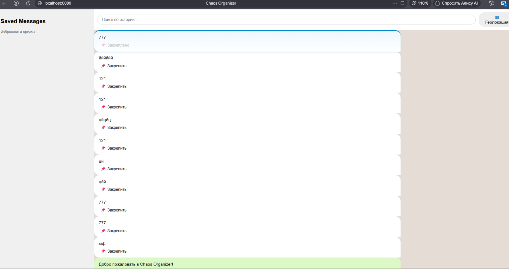

# Chaos Organizer

Бот-органайзер в стиле Telegram

### Обязательные функции:
- сохранение в истории ссылок и текстовых сообщений
- ссылки (http:// или https://) кликабельны
- сохранение в истории изображений, видео и аудио- через Drag&Drop и иконку загрузки
- скачивание файлов на компьютер пользователя
- ленивая подгрузка

## Технологии

- Webpack, Babel, ESLint
- JavaScript (ES6+)
- HTML5, CSS3

## Скриншоты

